# **🦅 HawkLink Tactical System**

<p align="center">
  
</p>

<p align="center">
  <a href="https://github.com/ayushmishra-18/HawkLink-Tactical">
    
  </a>
  <a href="https://flutter.dev">
    
  </a>
  <a href="LICENSE">
    
  </a>
  <a href="https://github.com/ayushmishra-18/HawkLink-Tactical">
    
  </a>
</p>

---

## **🔒 Mission Critical Security**

**HawkLink is a military-grade, offline-first Command & Control (C2) platform.**  
Designed for tactical situational awareness in hostile, zero-trust environments (GPS-denied, jammed, or off-grid zones).

  **Rating**: 95/100 (Critical Systems Grade)

| Specification | Implementation Detail |
| :--- | :--- |
| **Zero-Trust Network** | Authenticates **every** packet. No device is trusted by default. |
| **Authentication** | **Mutual TLS (mTLS)** with X.509 Certificates (RSA-4096 Root CA). |
| **Encryption** | **AES-256-GCM** (Galois/Counter Mode) for Authenticated Encryption (AEAD). |
| **Key Exchange** | **ECDH P-256** (Elliptic Curve Diffie-Hellman) for Perfect Forward Secrecy. |
| **Command Integrity** | **RSA-2048** Digital Signatures for high-risk commands (e.g., Remote Wipe). |
| **Architecture** | **Offline-First Star Topology**. No Cloud. No External Servers. |

---

## **🏗️ System Architecture**

HawkLink operates on a secure **Star Network Topology** where the Commander Console acts as the central authority.

```mermaid
graph TD
    subgraph "Secure Tactical Network (Offline LAN/Mesh)"
    
    A[🖥️ COMMANDER CONSOLE]
    style A fill:#1a237e,stroke:#fff,stroke-width:4px,color:#fff
    
    B[📱 SOLDIER ALPHA]
    C[📱 SOLDIER BRAVO]
    D[📱 SOLDIER CHARLIE]
    style B fill:#1b5e20,stroke:#81c784,stroke-width:2px,color:#fff
    style C fill:#1b5e20,stroke:#81c784,stroke-width:2px,color:#fff
    style D fill:#1b5e20,stroke:#81c784,stroke-width:2px,color:#fff

    A <== "mTLS Tunnel (AES-256)" ==> B
    A <== "mTLS Tunnel (AES-256)" ==> C
    A <== "mTLS Tunnel (AES-256)" ==> D
    
    end
```



---

## **📡 System Components**

This repository contains two independently built but tightly integrated applications:

### **1. 🖥️ Commander Console (The "God View")**
The strategic dashboard for the mission commander.  
*   **Target**: Windows / Linux / macOS
*   **Key Features**:
    *   **3D Satellite Mapping**: Real-time terrain visualization using ArcGIS High-Res imagery.
    *   **Live Bio-Telemetry**: EKG-style heart rate, battery voltage, and ammunition status.
    *   **Mission Coordination**: Drag-and-drop waypoints (Rally, Hostile, Medvac) that sync instantly.
    *   **Remote Kill Switch**: Cryptographically signed command to wipe a compromised device.

### **2. 📱 Soldier Uplink (The "Field Unit")**
The tactical interface for operators on the ground.
*   **Target**: Android (Physical Device)
*   **Key Features**:
    *   **AR Compass HUD**: Augmented Reality overlay showing direction and distance to objectives.
    *   **Acoustic Gunshot Detection**: Algorithms to detect high-decibel spikes (>110dB) and auto-report contacts.
    *   **Stealth Mode**: OLED-optimized blackout UI with red-tinted night vision support.
    *   **Biometric Scanning**: Uses the camera sensor to measure heart rate via PPG (Photoplethysmography).

---

## **🛠️ Tech Stack**

### **Framework & Core**
* **Flutter (Dart)** - Cross-platform framework
* **TCP Sockets** - Low-latency communication layer

### **Security**
* **PointyCastle** - Cryptographic library (ECDH, AES-GCM, RSA)
* **BasicUtils** - Certificate generation utilities
* **FlutterSecureStorage** - Platform secure storage (Keystore/Keychain)

### **Mapping & Navigation**
* **flutter_map** + **latlong2** - Interactive tactical maps
* **ArcGIS Satellite Tiles** - High-resolution terrain imagery
* **geolocator** - GPS positioning
* **flutter_compass** - Magnetic heading

### **Sensors & Hardware**
* **camera** - AR compass & bio-scanning (PPG heart rate)
* **noise_meter** - Acoustic gunshot detection
* **battery_plus** - Hardware monitoring
* **record** - Black box audio encryption

### **Media & Communication**
* **audioplayers** - Audio playback for alerts
* **flutter_tts** - Voice command synthesis
* **image_picker** - Tactical intel photos

---

## **🚀 Quick Start Guide**

### **Prerequisites**
*   **Flutter SDK**: Version 3.22 or higher.
*   **OpenSSL**: Required for certificate generation (included with Git for Windows).
*   **Android Device**: Required for Soldier Uplink (Emulators lack Bluetooth/Camera sensors).

### **📥 1. Installation**
```bash
# Clone the repository
git clone https://github.com/ayushmishra-18/HawkLink-Tactical.git
cd HawkLink-Tactical
```

### **🔐 2. Initialize Security Infrastructure**
We must generate a Secure PKI (Public Key Infrastructure) before the apps can talk.
Run the automated initialization tool:
```bash
cd commander_console
dart run tools/generate_certs.dart
```
> **⚠️ Critical Step**: This script creates a unique **Root CA**, issues derived certificates for Server and Client, and automatically installs them into the Android project (`hawklink_client/assets/certs/`).

### **▶️ 3. Launch Commander Console**
```bash
flutter pub get
flutter run -d windows
```
*   **Action**: Note the **IP Address** displayed on the Connection Panel.

### **▶️ 4. Launch Soldier Uplink**
```bash
cd ../hawklink_client
flutter pub get
flutter run -d android
```
*   **Action**: Enter the Commander's IP Address and tap **"INITIATE HANDSHAKE"**.

---

## **🛠️ Troubleshooting**

| Issue | Potential Cause | Solution |
| :--- | :--- | :--- |
| **"Handshake Failed"** | Certificate Mismatch | Re-run `generate_certs.dart` and restart both apps. Certificates must match exactly. |
| **"Connection Refused"** | Firewall Blocking | Allow `commander_console.exe` through Windows Firewall on Port `4040`. |
| **"Sensors Not Found"** | Emulator Usage | You must use a physical Android device for functionality like AR, Biometrics, and Bluetooth. |
| **"Map Tiles Missing"** | No Internet | The initial map cache requires internet. Once loaded, it works offline. |

---

## **🛡️ Detailed Threat Model**

### **1. Man-in-the-Middle (MitM) Attacks**
*   **Defense**: **Certificate Pinning**. The apps do not trust system CAs; they only trust the specific Root CA generated during setup. An attacker cannot intercept traffic without physically stealing the `ca-key.pem` from the Commander's machine.

### **2. Device Capture / Compromise**
*   **Defense**: **Secure Zeroization**. If a soldier is captured, the Commander issues a "Remote Wipe" command. This command is signed by the Commander's RSA Private Key. The soldier device verifies the signature prevents spoofed wipe commands.

### **3. Radio Frequency (RF) Snooping**
*   **Defense**: **AES-256-GCM**. Even if the raw TCP packets are intercepted over WiFi, the payload is indistinguishable from random noise.

---

---

## **📄 License**

This project is licensed under the **MIT License** - see the [LICENSE](LICENSE) file for details.

---

## **📜 Disclaimer**
This software is a **PROTOTYPE** intended for educational, research, and demonstration purposes.

*   **Not MilSpec Certified**: While it uses military-grade algorithms, the implementation has not undergone formal government usage certification.
*   **No Warranty**: Provided "AS IS" under MIT License.
*   **Legal Compliance**: Usage of encryption and radio frequencies must comply with local laws.
---

## **🤝 Contributing**

Contributions welcome! Please read our security guidelines before submitting:

1. **Security Patches**: Responsibly disclose vulnerabilities via email
2. **Feature Requests**: Open an issue with security impact analysis
3. **Code Review**: All PRs undergo security audit before merge

---
---

## **📧 Contact**

**Project Maintainer**: Ayush Mishra  
**E-mail**: ayush1810mishra@gmail.com 
**Last Updated**: January 2026

---

<p align="center">
  <b>Built with 🛡️ Security-First Design by Ayush Mishra/b><br>
  <i>"Protecting Those Who Protect Us"</i>
</p>
